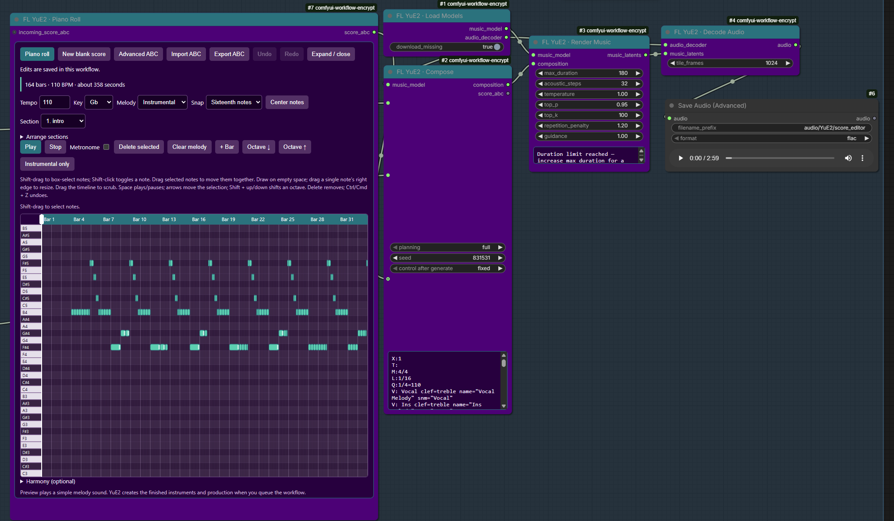
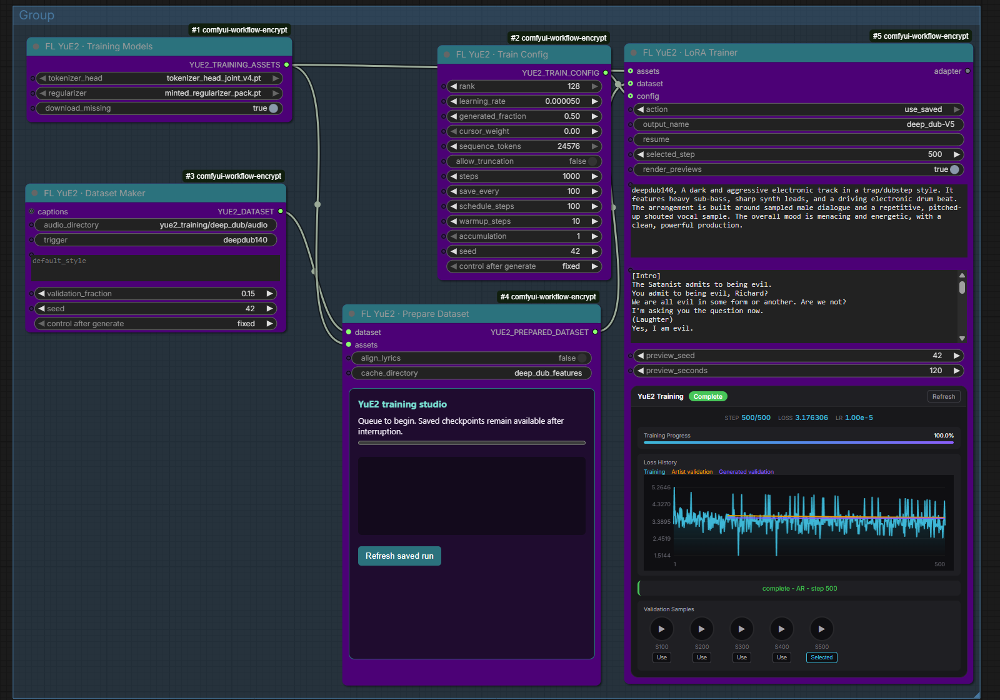
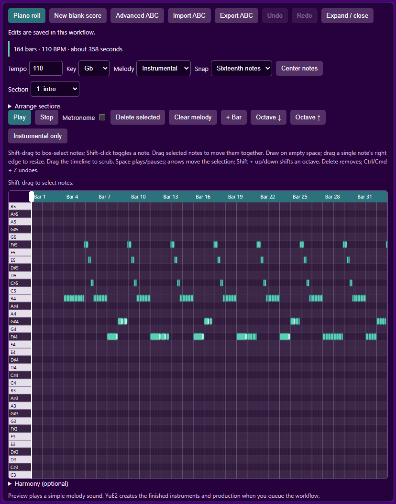
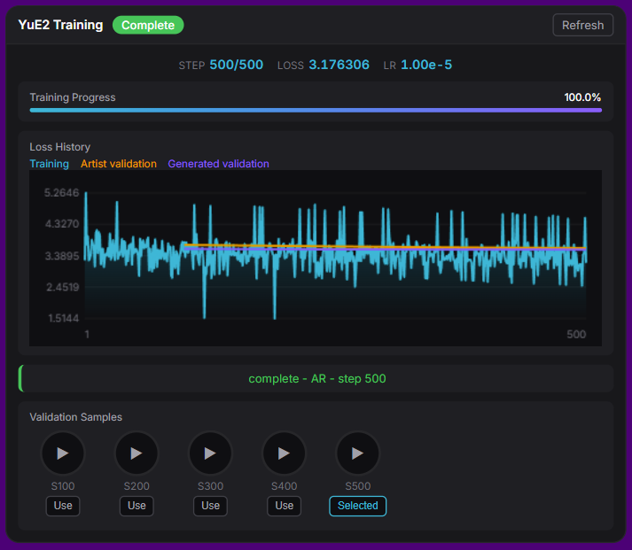
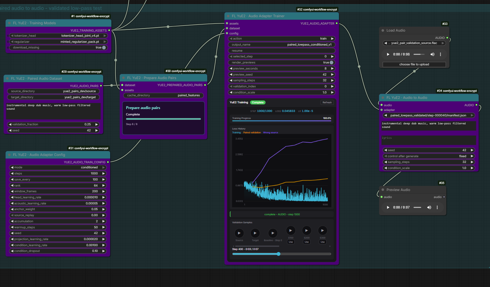

# FL YuE2 for ComfyUI





[](https://github.com/multimodal-art-projection/YuE)
[](https://www.patreon.com/Machinedelusions)
[](https://registry.comfy.org/publishers/machinedelusions/nodes/comfyui-fl-yue2)

Compose songs from lyrics and style, build or import an ABC score, and render 48 kHz stereo audio with YuE2-3B. Generate music and train AR LoRAs with reviewed datasets and checkpoint previews. The nodes work with ComfyUI's standard audio preview, saving, and processing nodes.

## Install

Install **ComfyUI-FL-YuE2** through ComfyUI Manager, or install manually:

```bash
cd ComfyUI/custom_nodes
git clone https://github.com/filliptm/ComfyUI-FL-YuE2.git
cd ComfyUI-FL-YuE2
python -m pip install -r requirements.txt
```

Use the Python environment that runs ComfyUI, then restart ComfyUI. This pack uses ComfyUI's existing Torch installation; it does not install the upstream YuE2 package or downgrade Torch.

Requires a current ComfyUI with Comfy Kitchen's split-half RMS/RoPE operation and an NVIDIA GPU supporting BF16. Validated on Windows/Python 3.12/Torch 2.11 with an RTX PRO 6000 Blackwell. Other devices and 24 GB configurations have not been validated for this integration.

The first queued **Load Models** node downloads approximately 7.8 GB:

```text
ComfyUI/models/yue2/YuE2-3B/
ComfyUI/models/yue2/YuE2-Vae/
```

Downloads resume after an interrupted transfer and verify the weight manifest. Nothing downloads at startup. Turn off `download_missing` for offline use. An external model root can be registered as `yue2` through `extra_model_paths.yaml`; existing installed models are searched before downloading. Model weights, configuration, tokenizer, and license files are required; an empty directory is not an installation.

## Start a song

Drag the included [score editor workflow](example_workflows/score_editor_to_song.json) onto ComfyUI. It connects **Piano Roll → Compose → Render Music → Decode Audio → Preview/Save**, with a shared model loader. The eight-bar instrumental score is editable, lyrics are blank, planning is `full`, and rendering has a 45-second upper limit. Files go under `output/audio/YuE2/`. The screenshots above show real ComfyUI workflows. The training screenshot displays an existing saved AR run.

1. **Load Models** provides the music model and separate audio decoder.
2. **Compose** accepts musical style, lyrics, planning mode, and seed. Describe genre, instruments, language, vocal character, mood, and tempo. Use `[Verse]` and `[Chorus]` lyric sections separated by blank lines.
3. **Render Music** generates music tokens and acoustic latents. `max_duration` is an upper bound, not a requested exact length. `acoustic_steps=32` matches the released midpoint solver.
4. **Decode Audio** returns ordinary ComfyUI `AUDIO`. Smaller `tile_frames` reduces decoder memory use.

`full` planning writes melody and chords; `melody` leaves accompaniment freer; `off` skips the symbolic score. Default guidance is 1.0 for score-conditioned generation; upstream recommends 1.01 for direct generation. Other sampling defaults match the release.

The Compose node displays generated ABC. Connect core **Preview as Text** to its score output to compose without rendering audio. Disconnect the supplied score to generate a new score from style and lyrics. An unchanged composition retains its exact token prefix through the composition socket.

Supplying a score requires `full` or `melody`. This is score-conditioned generation, not audio transcription. SheetSage2/audio-to-score transcription is a separate upstream environment and is not included in this pack.

The output is a stereo mix. Use an existing audio-separation node for stems. Editing a composition generates a new recording; it does not preserve unchanged regions of an earlier waveform.

For instrumental prompts, leave lyrics blank and describe the instrumentation in style. `full` generates melody and chords; `melody` generates a melody score. Only `off` skips planning. A supplied ABC score bypasses score generation and retains the selected `full` or `melody` instruction. Blank lyrics never override your planning choice.

## Score editor



Open `example_workflows/score_editor_to_song.json` for the eight-bar instrumental example. **Piano Roll** outputs a STRING connected to Compose's `score_abc` input; use `full` planning and blank lyrics for this example.

- **Piano roll:** click empty space to add a note, drag it to move pitch/time, and drag its white right-edge handle to change length. Right-click or select and press Delete to remove it. Snap uses familiar quarter/eighth/sixteenth-note values; gaps become rests automatically.
- **Multiple notes:** hold Shift and drag a box to add notes to the selection; Shift-click toggles individual notes. Selected notes have white borders and a dashed group outline. Drag any selected note to move the group with its timing, durations and pitch intervals intact. Arrow keys and Delete affect the whole selection. Overlapping moves are rejected together; Undo restores the edit. Selection applies to the displayed melody track.
- Choose **Instrumental** or **Sung melody**, select the section, and edit notes visually. **Instrumental only** clears the sung melody while retaining chords. **New blank score** starts four empty bars. **Undo/Redo** restores visual edits.
- **Harmony (optional)** holds the per-bar chord controls and starts collapsed. Chords remain in the score while hidden. Imported changes within a bar and slash chords are preserved; advanced edits remain available in ABC.
- Add bars, duplicate/reorder/remove sections, and set tempo. Sustained notes crossing section boundaries must be shortened before structural edits. Changing **Key** transposes both melodies and chord roots/bass notes by the same shortest interval. Timing and melodic intervals stay intact. Switching major/minor does not rewrite the melody into a different mode. Out-of-range transpositions are rejected rather than clipping notes.
- **Play / Pause** previews the selected section/voice through a simple browser synthesizer. It does not load YuE2 or preview its final production. **Metronome** adds beat clicks with a bar-start accent; it is preview-only and is not sent to YuE2.
- Import/export ABC or open **Advanced ABC** for meter changes and specialist notation. The existing workflow stores the score in the same STRING widget, and existing connections continue to work. Imports with key/meter changes stay in the advanced view.
- Edits are validated locally, including monophonic overlap checks, before replacing the saved score. Export and node execution also validate. Audio adherence remains generative.

This is a MIDI-style piano roll backed by YuE2 ABC, with two monophonic melodies and a separate chord lane. MIDI-file import/export and audio transcription are not included. Instrument choices and sound design remain in Compose's style prompt. The upstream parser is structural validation; a rejection may mean unsupported native notation rather than invalid general ABC.

**Navigation and audition:** Expand / close opens a larger editor; Escape closes it when the editor is focused. Click or drag empty space to draw; drag an existing note to move it and hear each pitch change. **Center notes** centers the pitch range. Arrow keys move the selected note by a semitone or snap step; Shift + up/down moves an octave. Drag the timeline or playhead to scrub continuously. Space plays/pauses from the current position; Stop rewinds to the section start. Scrubbing during playback resumes at the new position when released. Section arrangement controls are under Arrange sections.

The canvas node grows to fit its controls and the full piano height, including opened arrangement controls and wrapped chord cards. Its minimum height follows the content. The timeline always fits the current section; there are no tool or editor-zoom menus. Wheel zoom and middle-drag pan still control the ComfyUI canvas over the node. The expanded window remains limited to the browser viewport and can scroll on smaller screens.

**Edit generated scores:** connect Compose's `score_abc` output to Piano Roll's optional `incoming_score_abc` input, then queue to load the score. Edit it directly while connected. Re-queuing with unchanged upstream ABC retains and outputs your edits; changed upstream ABC loads a new score. The score and its source fingerprint are saved in the workflow. Disconnecting retains the current edited score. Restart ComfyUI and refresh the browser when upgrading to this behavior.

For generated-score editing, connect **Compose → Piano Roll → a second Compose → Render → Decode**. The second Compose uses the supplied score without generating another score. Keep its style and lyrics consistent with the first Compose. To inspect before spending time rendering, mute the downstream Render/Decode/audio output nodes, queue the Piano Roll, edit the score, then re-enable rendering. Queueing the entire chain does not pause automatically for edits. Never feed the editor back into the same Compose node that supplies its input.

Interaction choices follow the navigation, drawing, preview and editing patterns documented in [Ableton's MIDI editor](https://www.ableton.com/en/manual/editing-midi/) and [FL Studio's piano roll](https://www.image-line.com/fl-studio-learning/fl-studio-online-manual/html/pianoroll.htm), adapted to the score controls YuE2 supports.

## Troubleshooting

- **Ending cut short:** increase `max_duration`. The node reports when the token limit is reached.
- **Score token limit:** Compose uses a fixed 12,000-token score budget. If the score does not finish, it closes the score token sequence and continues using the partial score in the selected planning mode. The node reports the cutoff; the final score phrase may be incomplete.
- **Out of memory:** reduce duration or decoder tile size, close other GPU workloads, and retry. The pack uses ComfyUI model management and does not change global CUDA memory limits.
- **Corrupt checkpoint:** remove only the file named in the error, enable downloads, and queue again. Partial transfers are retained for resumption.
- **Node missing:** restart ComfyUI and inspect the startup import error. No other FL pack is required.
- **Editor validation unavailable:** restart ComfyUI after installing this version, then refresh the browser. The editor uses the pack's local `/fl_yue2/score/validate` endpoint.

## Training



See [training guide](docs/TRAINING.md) for Gemini music captions, AR LoRA training, resume, and checkpoint playback. Training assets download into ComfyUI model folders when queued with download_missing enabled; Python training dependencies are installed separately.

Use [Training Studio](example_workflows/training_studio.json) with your own recordings and captions. The experimental `train_acoustic` option in Train Config learns an acoustic companion alongside the AR LoRA; previews and Load LoRA select both weights automatically. Generation remains text-only. Install the optional training dependencies in ComfyUI's Python environment:

```bash
python -m pip install -r requirements-training.txt
```

Queuing `train` with blank `resume` starts fresh and overwrites the named run and its checkpoints/previews. Change the output name to keep an earlier run, or set `resume=resume.pt` to continue it.

Generated captions are accepted automatically and remain editable. With previews enabled, a step-0 baseline renders before training starts, followed by a sample at each checkpoint. A separate inference progress bar tracks sample generation before training resumes. `Use` selects a saved checkpoint for inference without retraining.

Paired **audio-to-audio adapters** have a separate [training guide](docs/AUDIO_ADAPTERS.md). Train from aligned source/target recordings with continuous source-audio conditioning, acoustic LoRAs, or source encoder head adaptation. The trainer compares source, target, step-0 baseline and saved checkpoints with playable validation samples. The screenshot below shows the real conditioned low-pass training run.



## Development and validation

Python implementation lives in `yue2/`, including `yue2/training/`. The root `__init__.py` registers the nodes; browser widgets live in `web/` and supporting documentation in `docs/`. Example graphs remain in `example_workflows/`.

From the ComfyUI root:

```powershell
.\venv\Scripts\python.exe -m pytest custom_nodes/ComfyUI-FL-YuE2/tests --rootdir=. --import-mode=importlib -q
```

See [validation notes](docs/VALIDATION.md) for the tested environment, generated results, and remaining limitations. Inference and training examples are in `example_workflows/`. Changing the version in `pyproject.toml` on `main` triggers registry publishing through `.github/workflows/publish.yml`; maintainers can also run it manually.

## Attribution and licenses

Adapted from [YuE2](https://github.com/multimodal-art-projection/YuE), commit `92a73cc7652fcc1f937855e4b765e0a0edd7ff2e`. Source code is Apache 2.0. **Model weights are CC BY-NC 4.0**, separately from the source license. Preserve `LICENSE`, `MODEL_LICENSE`, and `THIRD_PARTY_NOTICES.md` when redistributing.

Pinned checkpoints: YuE2-3B `1a96eca688d6ae5d7f0feb88573fec89920fcd19`; YuE2-Vae `95535e72a97bc0f09b8ada125d26b4009428c0e8`.
